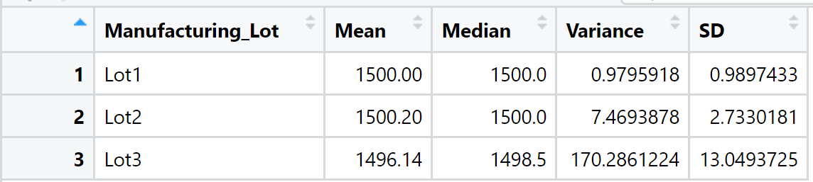

# MechaCar Statistical Analysis

## 1 Introduction

A program was written in R to conduct a statistical analysis of data provided by MechaCar to determine performance of various protypye car models they were designing.  

The results are discussed in sections:

- 2.1 Linear Regression to Predict MPG
- 2.2 Summary Statistics on Suspension Coils
- 2.3 T-Tests on Suspension Coils

The summary section also includes a recommended study design that can be found in section 3.1 Study Design: MechaCar vs Competition.

## 2 Results

### 2.1 Linear Regression to Predict MPG

The following tasks were undertaken to predict MPG via Linear Regression.

A csv file was imported and read into a dataframe as follows. 

```R
MechCar_MPG <- read.csv('MechaCar_mpg.csv',stringsAsFactors = F)
```

An RScript ws written for a linear regression model to be performed on six variables. 

```R
lm(mpg ~ vehicle_length + vehicle_weight + spoiler_angle + ground_clearance + AWD, data=MechCar_MPG)
```

An RScript was written to create the statistical summary of the linear regression model with the intended p-values. 

```R
summary(lm(mpg ~ vehicle_length + vehicle_weight + spoiler_angle + ground_clearance + AWD, data=MechCar_MPG))
```

Below is the output of the summary of the linear regression model.

```R
Call:
lm(formula = mpg ~ vehicle_length + vehicle_weight + spoiler_angle + 
    ground_clearance + AWD, data = MechCar_MPG)

Residuals:
     Min       1Q   Median       3Q      Max 
-19.4701  -4.4994  -0.0692   5.4433  18.5849 

Coefficients:
                   Estimate Std. Error t value Pr(>|t|)    
(Intercept)      -1.040e+02  1.585e+01  -6.559 5.08e-08 ***
vehicle_length    6.267e+00  6.553e-01   9.563 2.60e-12 ***
vehicle_weight    1.245e-03  6.890e-04   1.807   0.0776 .  
spoiler_angle     6.877e-02  6.653e-02   1.034   0.3069    
ground_clearance  3.546e+00  5.412e-01   6.551 5.21e-08 ***
AWD              -3.411e+00  2.535e+00  -1.346   0.1852    
---
Signif. codes:  0 ‘***’ 0.001 ‘**’ 0.01 ‘*’ 0.05 ‘.’ 0.1 ‘ ’ 1

Residual standard error: 8.774 on 44 degrees of freedom
Multiple R-squared:  0.7149,	Adjusted R-squared:  0.6825 
F-statistic: 22.07 on 5 and 44 DF,  p-value: 5.35e-11

```

The t-values quantify the difference between the population means and the corresponding p-values of each coefficient, ( i.e. "Pr(>|t|)" ) is the probability of obtaining a t-value with an absolute value at least as large as the one observed in the sample data, if the null hypothesis is actually true.

In summary addressing the three questions that MechaCar had in regards to MPG are answered bleow.

- Which variables/coefficients provided a non-random amount of variance to the mpg values in the dataset?

  We need to determine if we can reject the Null Hypothesis in favour of the Alternate Hypothesis.

  **Null Hypothesis H<sub>0</sub>:** μ1 = μ2 (the variable has no apparent affect on the outcome)

  **Alternate Hypotheses H<sub>a</sub>:** μ1 ≠ μ2 (the variable has sufficient evidence of an affect on the outcome)

  It the test above the following variables/coefficients by virtual of their p-value exceeding 0.05 that we fail to reject the null hypothesis.

  ***vehicle_length***

  ***spoiler_angle***

  ***AWD*** 

- Is the slope of the linear model considered to be zero? Why or why not?

  To answer this question, linear regression tests the following hypotheses:

  **Null Hypothesis H<sub>0</sub>:**  The slope of the linear model is zero, or m = 0

  **Alternate Hypotheses H<sub>a</sub>:**  The slope of the linear model is not zero, or m ≠ 0

  If there is no significant linear relationship, each dependent value would be determined by random chance and error. Therefore, our linear model would be a flat line with a slope of 0.

  The r-squared (r<sup>2</sup>) value is also known as the coefficient of determination and represents how well the regression model approximates real-world data points. In most cases, the r-squared value will range between 0 and 1 and can be used as a probability metric to determine the likelihood that future data points will fit the linear model.

  With a significant r-squared (adjusted) value of 0.6825 their is evidence that the slope is non-zero, this is further supported by the fact the a p-value of 5.35e<sup>-11</sup> is essentially zero indicating that this correlation is not likely to be by chance.

- Does this linear model predict mpg of MechaCar prototypes effectively? Why or why not?

  Continuing with the discussion above the adjusted r-squared being a modified version of r-squared is adjusted for the number of predictors in the model. The adjusted r-squared increases when the new term improves the model more than would be expected by chance. It decreases when a predictor improves the model by less than expected.  While the model does a reasonably good job of predicting mpg, there is evidence of overfitting - the model could actually be improved by removing the vehicle_length and ground_clearance variables.

### 2.2 Summary Statistics on Suspension Coils

The follow tasks were undertaken to provide summary statistics of suspension coils.

A csv file was imported and read into a dataframe. 

```R
coil_table <- read.csv('Suspension_Coil.csv',stringsAsFactors = F)
```

The total summary dataframe has four metrics for all the manufacturing lots. 

```R
summarize_coil_pop <- coil_table %>% summarize(Mean=mean(PSI), Median=median(PSI),Variance=var(PSI), SD=sd(PSI), .groups = 'keep')
```

The lot summary dataframe has fourmetrics for each manufacturing lot. 

```R
summarize_coil_lot <- coil_table %>% group_by(Manufacturing_Lot) %>% summarize(Mean=mean(PSI), Median=median(PSI),Variance=var(PSI), SD=sd(PSI), .groups = 'keep')
```


***Figure 1 - Summarized Coil Population***

A summary that addresses the design specification requirement for all the manufacturing lots and the three lots is shown below.

```R
coil_lot1 <- coil_table %>% filter(Manufacturing_Lot=="Lot1") #select only data points where the Manufacturing_Lot is lot1
coil_lot1_PSI <- coil_lot1%>% select( c('PSI'))

coil_lot2 <- coil_table %>% filter(Manufacturing_Lot=="Lot2") #select only data points where the Manufacturing_Lot is lot2
coil_lot2_PSI <- coil_lot2%>% select( c('PSI'))

coil_lot3 <- coil_table %>% filter(Manufacturing_Lot=="Lot3") #select only data points where the Manufacturing_Lot is lot3
coil_lot3_PSI <- coil_lot3%>% select( c('PSI'))

```



***Figure 2 - Summarized Coil Lots***

The design specifications for the MechaCar suspension coils dictates that the variance of the suspension coils must not exceed 100 pounds per square inch. The results of the analysis indicates that lot 3, with a variance of over 170 PSI, does not meet the specifications.

### 2.3 T-Tests on Suspension Coils

### 2.3.1 T-Test against Population Mean

An RScript was written for a t-test that compares all manufacturing lots against the mean PSI of the population. 

```R
t.test(coil_pop_PSI,coil_pop_PSI$Mean)
```

An RScript was written for three t-tests that compare each manufacturing lot against the mean PSI of the population. 

```R
t.test(coil_lot1_PSI,coil_pop_PSI$Mean) #compare lot1 versus population mean
t.test(coil_lot2_PSI,coil_pop_PSI$Mean) #compare lot2 versus population mean
t.test(coil_lot3_PSI,coil_pop_PSI$Mean) #compare lot3 versus population mean
```

The summary addresses the results across all manufacturing lots and the three individua lots can be found below.

```R
	One Sample t-test

data:  coil_pop_PSI
t = 2325.7, df = 149, p-value < 2.2e-16
alternative hypothesis: true mean is not equal to 0
95 percent confidence interval:
 1497.507 1500.053
sample estimates:
mean of x 
  1498.78 
```


```R
	One Sample t-test

data:  coil_lot1_PSI
t = 10717, df = 49, p-value < 2.2e-16
alternative hypothesis: true mean is not equal to 0
95 percent confidence interval:
 1499.719 1500.281
sample estimates:
mean of x 
     1500 
```

```R
	One Sample t-test

data:  coil_lot2_PSI
t = 3881.4, df = 49, p-value < 2.2e-16
alternative hypothesis: true mean is not equal to 0
95 percent confidence interval:
 1499.423 1500.977
sample estimates:
mean of x 
   1500.2 
```

```R
	One Sample t-test

data:  coil_lot3_PSI
t = 810.71, df = 49, p-value < 2.2e-16
alternative hypothesis: true mean is not equal to 0
95 percent confidence interval:
 1492.431 1499.849
sample estimates:
mean of x 
  1496.14
```

### 2.3.2 T-Test against Design Specification of 1500 PSI

If you wanted to compare the lots directly against the design specification of 1500 psi you would run these t-tests.

```R
t.test(coil_lot1_PSI,mu = 1500)
t.test(coil_lot2_PSI,mu = 1500) 
t.test(coil_lot3_PSI,mu = 1500) 
```

The results of the test are essentially the same but look, for instance, at the p-value results and the alternate hypothesis. 

```R
> t.test(coil_lot1_PSI,mu = 1500) #compare sample versus specification of 1500 PSI

	One Sample t-test

data:  coil_lot1_PSI
t = 0, df = 49, p-value = 1
alternative hypothesis: true mean is not equal to 1500
95 percent confidence interval:
 1499.719 1500.281
sample estimates:
mean of x 
     1500
```

```R
> t.test(coil_lot2_PSI,mu = 1500) #compare sample versus specification of 1500 PSI

	One Sample t-test

data:  coil_lot2_PSI
t = 0.51745, df = 49, p-value = 0.6072
alternative hypothesis: true mean is not equal to 1500
95 percent confidence interval:
 1499.423 1500.977
sample estimates:
mean of x 
   1500.2
```

```R
> t.test(coil_lot3_PSI,mu = 1500) #compare sample versus specification of 1500 PSI

	One Sample t-test

data:  coil_lot3_PSI
t = -2.0916, df = 49, p-value = 0.04168
alternative hypothesis: true mean is not equal to 1500
95 percent confidence interval:
 1492.431 1499.849
sample estimates:
mean of x 
  1496.14 
```


## 3.0 Summary

In section 3.1 below is a recommendation for further investigation by MechaCar. We believe that MechaCar should try to validate their assertion that their vehicle provides the best fuel economy per pound of vehicle weight.  If they can do this, they will then be able to secure a huge market share in all vehicle classes.

### 3.1 Study Design: MechaCar vs Competition

With the rising cost of gas, fuel economy is important, however, comfort, road safety and load carrying capacity are also highly desirable - especially for young families.  Total vehicle weight is often a good measurement indicating the size of the vehicle, additional materials used for safety and comfort and total carrying capacity.  MechaCar asserts, due to their superior aeodynamic design features,  that their vehicles provide the best fuel economy per pound of vehilce.  Below is a test that can be run to test the idea. 

#### 3.1.1 Metric to be Tested

To test MechaCar's declaration, the metric that will be tested is overall fuel economy in mpg.

#### 3.1.2 Null or Alternative Hypothesis 

**Null Hypothesis H<sub>0</sub>:** MechaCar's overall fuel economy per pound of vehicle is no better than other manufactures

**Alternate Hypotheses H<sub>a</sub>:** MechaCar's overall fuel economy per pound of vehicle is superior to other manufactures

#### 3.1.3 Statistical test to Test the Hypothesis. 

You would run a t-test of all cars using vehicle weight on the x axis and fuel economy on the y axis to create a overall statistical model as a baseline population.  Next, you would extract the MechaCar prototypes to create a sample which you would then run against the population.  Doing this for all competitors of interest would then allow MechCar to "reject the Null Hypothesis" one competitor at a time. 

#### 3.1.4 Data Required for the Statistical Test

We would need to gather overall mpg and vehicle weight data of all MechaCar prototypes, as well as, from all major competitor vehicles.

## 


